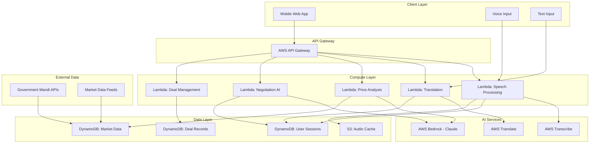

# Design Document: Multilingual Mandi AI

## Overview

Multilingual Mandi AI is a serverless, cloud-native platform that empowers local Indian vendors and farmers through AI-powered price discovery and smart negotiation assistance. The system leverages AWS services to provide real-time multilingual voice and text processing, enabling transparent and fair trade negotiations in local markets.

The platform addresses three core challenges: language barriers through multilingual AI, price transparency through market data analysis, and negotiation confidence through intelligent assistance. Built on AWS serverless architecture, it ensures scalability, cost-effectiveness, and high availability for users across India's diverse linguistic landscape.

## Architecture

### High-Level Architecture



### Technology Stack

**Frontend:**
- Progressive Web App (PWA) with responsive design
- HTML5 Web Speech API for voice input
- JavaScript/TypeScript for client-side logic
- CSS Grid/Flexbox for mobile-first responsive layout

**Backend Services:**
- AWS Lambda for serverless compute
- AWS API Gateway for REST API management
- AWS Transcribe for speech-to-text conversion
- AWS Translate for multilingual translation
- AWS Bedrock (Claude) for AI reasoning and negotiation

**Data Storage:**
- Amazon DynamoDB for NoSQL data storage
- Amazon S3 for audio file caching and static assets
- CloudWatch for logging and monitoring

**Integration:**
- Government mandi price APIs
- SMS gateway for deal confirmations
- Real-time WebSocket connections for live negotiations

## Components and Interfaces

### 1. Speech Processing Service

**Purpose:** Converts multilingual voice input to text with high accuracy

**Key Functions:**
- `processVoiceInput(audioBlob, languageCode)`: Converts speech to text
- `detectLanguage(audioBlob)`: Auto-detects spoken language
- `validateAudioQuality(audioBlob)`: Checks audio quality before processing

**AWS Integration:**
- Uses AWS Transcribe with language codes: `hi-IN`, `bn-IN`, `ta-IN`, `te-IN`, `en-IN`
- Supports both batch and streaming transcription
- Implements custom vocabulary for market-specific terms

**Interface:**
```typescript
interface SpeechProcessingService {
  transcribeAudio(audio: AudioBlob, language: LanguageCode): Promise<TranscriptionResult>
  detectLanguage(audio: AudioBlob): Promise<LanguageCode>
  validateQuality(audio: AudioBlob): Promise<QualityScore>
}

interface TranscriptionResult {
  text: string
  confidence: number
  language: LanguageCode
  timestamp: Date
}
```

### 2. Translation Engine

**Purpose:** Provides real-time bidirectional translation between supported languages

**Key Functions:**
- `translateText(text, sourceLanguage, targetLanguage)`: Core translation
- `maintainContext(sessionId, translations)`: Preserves conversation context
- `validateTranslation(original, translated)`: Quality assurance

**AWS Integration:**
- AWS Translate neural machine translation
- Custom terminology for market-specific vocabulary
- Context preservation across conversation turns

**Interface:**
```typescript
interface TranslationEngine {
  translate(text: string, source: LanguageCode, target: LanguageCode): Promise<Translation>
  addContext(sessionId: string, context: ConversationContext): Promise<void>
  validateTranslation(translation: Translation): Promise<ValidationResult>
}

interface Translation {
  originalText: string
  translatedText: string
  sourceLanguage: LanguageCode
  targetLanguage: LanguageCode
  confidence: number
}
```

### 3. Price Discovery Service

**Purpose:** Analyzes market data to provide fair price recommendations

**Key Functions:**
- `analyzePricing(product, location, quantity)`: Core price analysis
- `getMarketTrends(product, timeframe)`: Historical trend analysis
- `calculateFairPrice(marketData, contextFactors)`: AI-powered price calculation

**Data Sources:**
- Government mandi price databases
- Regional market data feeds
- Historical pricing patterns
- Seasonal adjustment factors

**Interface:**
```typescript
interface PriceDiscoveryService {
  analyzePrice(product: Product, context: MarketContext): Promise<PriceAnalysis>
  getTrends(product: Product, days: number): Promise<PriceTrend[]>
  validatePriceData(data: MarketData): Promise<ValidationResult>
}

interface PriceAnalysis {
  fairPrice: number
  confidence: number
  marketRange: PriceRange
  factors: PricingFactor[]
  recommendations: string[]
}
```

### 4. AI Negotiation Assistant

**Purpose:** Provides intelligent negotiation guidance using AWS Bedrock

**Key Functions:**
- `generateCounterOffer(currentOffer, marketData, context)`: Smart counter-offers
- `analyzeNegotiationPosition(history, marketData)`: Position assessment
- `suggestCompromise(vendorPosition, buyerPosition)`: Compromise solutions

**AWS Integration:**
- AWS Bedrock with Claude model for reasoning
- Custom prompts for negotiation scenarios
- Context-aware response generation

**Interface:**
```typescript
interface NegotiationAssistant {
  generateAdvice(scenario: NegotiationScenario): Promise<NegotiationAdvice>
  analyzePosition(position: NegotiationPosition): Promise<PositionAnalysis>
  suggestResponse(offer: Offer, context: NegotiationContext): Promise<ResponseSuggestion>
}

interface NegotiationAdvice {
  recommendation: string
  reasoning: string[]
  counterOffer?: number
  acceptanceAdvice: boolean
}
```

### 5. Session Management Service

**Purpose:** Manages user sessions and conversation state

**Key Functions:**
- `createSession(vendorId, buyerId)`: Initialize negotiation session
- `updateSessionState(sessionId, newState)`: Track conversation progress
- `getSessionHistory(sessionId)`: Retrieve conversation history

**Interface:**
```typescript
interface SessionManager {
  createSession(participants: Participant[]): Promise<Session>
  updateState(sessionId: string, state: SessionState): Promise<void>
  getHistory(sessionId: string): Promise<ConversationHistory>
}

interface Session {
  id: string
  participants: Participant[]
  language: LanguageCode
  startTime: Date
  status: SessionStatus
}
```

### 6. Deal Documentation Service

**Purpose:** Creates and manages deal confirmations and records

**Key Functions:**
- `createDealRecord(sessionId, terms)`: Document agreed terms
- `sendConfirmations(dealId, participants)`: SMS notifications
- `generateReceipt(dealId)`: Digital receipt generation

**Interface:**
```typescript
interface DealDocumentationService {
  createDeal(terms: DealTerms, session: Session): Promise<Deal>
  sendNotifications(deal: Deal): Promise<NotificationResult[]>
  generateReceipt(dealId: string): Promise<Receipt>
}

interface Deal {
  id: string
  sessionId: string
  terms: DealTerms
  participants: Participant[]
  timestamp: Date
  status: DealStatus
}
```

## Data Models

### Core Entities

```typescript
// User and Participant Models
interface Vendor {
  id: string
  name: string
  phoneNumber: string
  preferredLanguage: LanguageCode
  location: Location
  businessType: string
}

interface Buyer {
  id: string
  name: string
  phoneNumber: string
  preferredLanguage: LanguageCode
  location: Location
}

// Product and Market Models
interface Product {
  id: string
  name: string
  category: ProductCategory
  unit: MeasurementUnit
  seasonality: SeasonalPattern
}

interface MarketData {
  productId: string
  location: Location
  price: number
  quantity: number
  date: Date
  source: DataSource
  quality: QualityGrade
}

// Session and Conversation Models
interface ConversationTurn {
  id: string
  sessionId: string
  speaker: ParticipantType
  originalText: string
  translatedText?: string
  timestamp: Date
  audioUrl?: string
}

interface NegotiationState {
  currentOffer: number
  counterOffers: Offer[]
  marketPrice: number
  vendorMinPrice: number
  buyerMaxPrice: number
  status: NegotiationStatus
}

// Deal and Transaction Models
interface DealTerms {
  product: Product
  quantity: number
  pricePerUnit: number
  totalAmount: number
  deliveryTerms: string
  paymentTerms: string
}

// System Configuration Models
interface LanguageConfig {
  code: LanguageCode
  name: string
  transcribeSupported: boolean
  translateSupported: boolean
  voiceEnabled: boolean
}

interface MarketConfig {
  region: string
  supportedProducts: Product[]
  dataSources: DataSource[]
  updateFrequency: number
}
```

### Database Schema (DynamoDB)

**Table: Sessions**
- Partition Key: `sessionId` (String)
- Attributes: `participants`, `language`, `status`, `startTime`, `endTime`
- GSI: `participantId-startTime-index` for user session history

**Table: MarketData**
- Partition Key: `productId` (String)
- Sort Key: `location-date` (String)
- Attributes: `price`, `quantity`, `source`, `quality`
- GSI: `location-date-index` for regional price queries

**Table: Conversations**
- Partition Key: `sessionId` (String)
- Sort Key: `timestamp` (Number)
- Attributes: `speaker`, `originalText`, `translatedText`, `audioUrl`

**Table: Deals**
- Partition Key: `dealId` (String)
- Attributes: `sessionId`, `terms`, `participants`, `status`, `timestamp`
- GSI: `vendorId-timestamp-index` for vendor deal history

**Table: Users**
- Partition Key: `userId` (String)
- Attributes: `name`, `phoneNumber`, `preferredLanguage`, `location`, `type`
- GSI: `phoneNumber-index` for phone-based lookup

Now I need to use the prework tool to analyze the acceptance criteria before writing the Correctness Properties section.

## Correctness Properties

*A property is a characteristic or behavior that should hold true across all valid executions of a system—essentially, a formal statement about what the system should do. Properties serve as the bridge between human-readable specifications and machine-verifiable correctness guarantees.*

Based on the prework analysis of acceptance criteria, the following properties ensure the system behaves correctly across all valid inputs and scenarios:

### Property 1: Multilingual Speech Recognition Accuracy
*For any* valid audio input in Hindi, Bengali, Tamil, Telugu, or English, the speech recognition system should achieve at least 90% transcription accuracy and provide appropriate error handling for invalid inputs.
**Validates: Requirements 1.1, 1.3**

### Property 2: Noise-Resilient Speech Processing  
*For any* audio input containing background noise or multiple speakers, the system should correctly identify and process the primary speaker's voice while filtering out interference.
**Validates: Requirements 1.2**

### Property 3: Bidirectional Translation Consistency
*For any* text input in supported languages, translating from language A to language B and then back to language A should preserve the core meaning, and all translations should complete within 2 seconds.
**Validates: Requirements 2.1, 2.2**

### Property 4: Translation Context Preservation
*For any* negotiation session, translations should maintain conversational context across all turns, ensuring coherent and contextually appropriate translations throughout the entire session.
**Validates: Requirements 2.5**

### Property 5: Real-Time Price Discovery
*For any* product mentioned by a vendor, the system should analyze current market data and provide a fair price recommendation within 3 seconds, including confidence levels and data sources.
**Validates: Requirements 3.1, 3.3**

### Property 6: Intelligent Price Fallback
*For any* product without direct market data, the system should use similar product categories to generate reasonable price estimates with appropriate confidence indicators.
**Validates: Requirements 3.2**

### Property 7: Dynamic Price Adjustment
*For any* price analysis request, the system should incorporate seasonal trends, demand patterns, and regional variations to provide contextually accurate pricing recommendations.
**Validates: Requirements 3.4, 7.5**

### Property 8: Smart Negotiation Guidance
*For any* negotiation scenario where a buyer's offer is below fair price, the AI assistant should generate logical counter-offers with clear justifications based on market data.
**Validates: Requirements 4.1, 4.3**

### Property 9: Negotiation Conflict Resolution
*For any* negotiation that reaches an impasse, the system should propose data-driven compromise solutions that consider both parties' positions and market realities.
**Validates: Requirements 4.2**

### Property 10: Adaptive Negotiation Learning
*For any* series of negotiations, the system should track successful patterns and adapt future suggestions to improve negotiation outcomes over time.
**Validates: Requirements 4.4**

### Property 11: Multilingual User Feedback
*For any* user interaction requiring feedback, the system should provide responses (visual, audio, or text) in the user's preferred native language.
**Validates: Requirements 1.4, 5.3, 3.5**

### Property 12: Offline Functionality Resilience
*For any* network connectivity issues, the system should gracefully degrade to cached functionality while clearly indicating offline status and data freshness.
**Validates: Requirements 5.5, 7.2**

### Property 13: Comprehensive Deal Documentation
*For any* successful negotiation agreement, the system should create complete deal records with all required fields (timestamps, prices, quantities, participants) and generate documentation in both parties' preferred languages.
**Validates: Requirements 6.1, 6.3, 6.4**

### Property 14: Deal Notification Delivery
*For any* confirmed deal, the system should send SMS notifications to all participants containing accurate deal details within 30 seconds of confirmation.
**Validates: Requirements 6.2**

### Property 15: Historical Data Access
*For any* authenticated user, the system should provide access to their complete deal history with proper filtering and search capabilities.
**Validates: Requirements 6.5**

### Property 16: Market Data Validation and Freshness
*For any* incoming market data, the system should validate accuracy, flag anomalies, and maintain data freshness through regular updates every 4 hours.
**Validates: Requirements 7.1, 7.3**

### Property 17: Historical Data Retention
*For any* market data or price trend, the system should maintain historical records for at least 12 months to support trend analysis and price predictions.
**Validates: Requirements 7.4**

### Property 18: Graceful Error Handling
*For any* service outage or system error, the platform should implement proper error handling and graceful degradation without data loss or security compromise.
**Validates: Requirements 8.3**

### Property 19: Data Encryption and Security
*For any* voice data or sensitive information, the system should encrypt data during transmission and storage, ensuring secure handling throughout the data lifecycle.
**Validates: Requirements 9.1**

### Property 20: Session Data Isolation
*For any* concurrent negotiation sessions, the system should ensure complete data isolation, preventing information leakage between different negotiations.
**Validates: Requirements 9.5**

### Property 21: Voice Data Retention Policy
*For any* voice recording, the system should automatically delete the data after session completion unless explicit user consent is provided for retention.
**Validates: Requirements 9.3**

### Property 22: Authentication Security
*For any* user authentication attempt, the system should implement secure authentication mechanisms and properly handle both successful and failed authentication attempts.
**Validates: Requirements 9.4**

### Property 23: System Monitoring and Alerting
*For any* system metric (speech accuracy, translation quality, response times), the platform should continuously monitor performance and trigger alerts when thresholds are exceeded.
**Validates: Requirements 10.1, 10.2, 10.3**

### Property 24: Comprehensive Interaction Logging
*For any* user interaction with the platform, the system should log sufficient detail for debugging and improvement purposes while respecting privacy requirements.
**Validates: Requirements 10.4**

### Property 25: Real-Time System Health Monitoring
*For any* system component, the platform should provide real-time health and usage metrics through monitoring dashboards for operational visibility.
**Validates: Requirements 10.5**

## Error Handling

The platform implements comprehensive error handling across all components:

### Speech Processing Errors
- **Audio Quality Issues**: Prompt user to improve audio quality or switch to text input
- **Language Detection Failures**: Fall back to user's preferred language setting
- **Transcription Timeouts**: Retry with shorter audio segments or suggest text input

### Translation Errors  
- **Ambiguous Text**: Request clarification from the speaker with suggested alternatives
- **Unsupported Language Pairs**: Gracefully fall back to English as intermediate language
- **Context Loss**: Maintain conversation history and re-establish context when possible

### Price Discovery Errors
- **Missing Market Data**: Use similar product categories with confidence indicators
- **Stale Data**: Display data age warnings and suggest manual price verification
- **Analysis Timeouts**: Provide cached price estimates with appropriate disclaimers

### Negotiation Assistant Errors
- **AI Service Unavailability**: Fall back to rule-based negotiation suggestions
- **Context Overflow**: Summarize conversation history to maintain context within limits
- **Inappropriate Suggestions**: Implement content filtering and fallback to conservative advice

### System-Level Errors
- **Database Connectivity**: Use local caching and queue operations for later processing
- **External API Failures**: Implement circuit breakers and graceful degradation
- **Authentication Failures**: Provide clear error messages and recovery options

## Testing Strategy

The testing approach combines unit testing for specific scenarios with property-based testing for comprehensive coverage:

### Unit Testing Focus
- **Specific Examples**: Test concrete scenarios like "Hindi speech input with market noise"
- **Edge Cases**: Test boundary conditions like empty inputs, maximum data sizes
- **Integration Points**: Test AWS service integrations and external API connections
- **Error Conditions**: Test specific failure scenarios and recovery mechanisms

### Property-Based Testing Configuration
- **Testing Library**: Use fast-check for JavaScript/TypeScript property-based testing
- **Minimum Iterations**: 100 iterations per property test to ensure statistical confidence
- **Test Tagging**: Each property test tagged with format: **Feature: multilingual-mandi-ai, Property {number}: {property_text}**

### Property Test Implementation
Each correctness property will be implemented as a property-based test that:
- Generates random valid inputs within the property's domain
- Executes the system behavior under test
- Verifies the property holds for all generated inputs
- Reports counterexamples when properties fail

### Test Data Generation
- **Multilingual Text**: Generate random text in Hindi, Bengali, Tamil, Telugu, English
- **Audio Samples**: Create synthetic audio with varying quality and noise levels  
- **Market Data**: Generate realistic price data with seasonal and regional variations
- **User Scenarios**: Create diverse vendor/buyer profiles and negotiation contexts

### Performance Testing
- **Load Testing**: Verify system handles concurrent users without degradation
- **Latency Testing**: Ensure response times meet specified thresholds (2-3 seconds)
- **Scalability Testing**: Validate AWS Lambda auto-scaling under traffic spikes

### Security Testing
- **Data Encryption**: Verify all sensitive data is properly encrypted
- **Authentication**: Test secure login and session management
- **Data Isolation**: Ensure session data doesn't leak between negotiations
- **Privacy Compliance**: Validate data retention and deletion policies